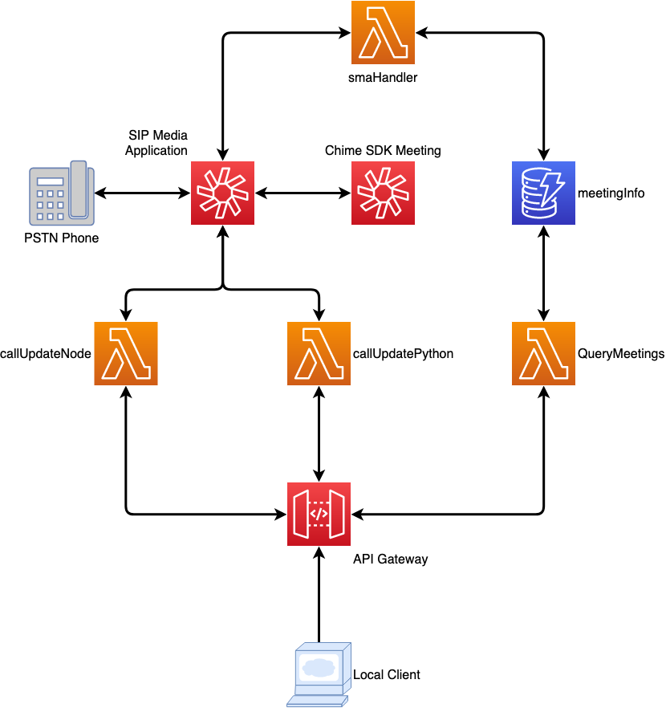
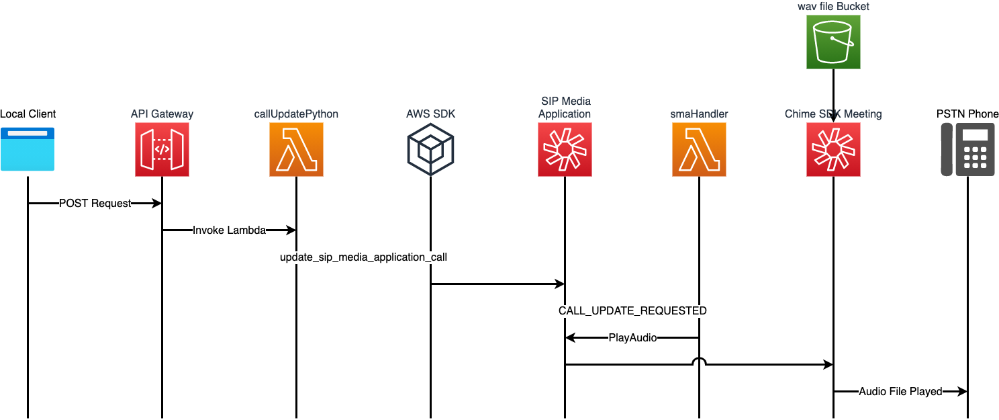
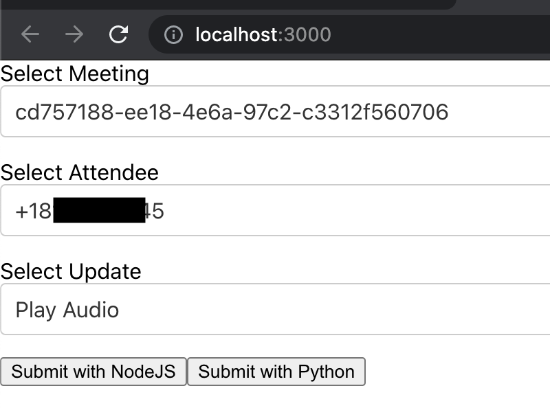

# Updating an In-Progress Amazon Chime SIP Media Application Call

This demo will build and configure several services within AWS so that you can create an SMA Phone Number that is able to join to a Chime SDK Meeting.  A separate client can be used to make changes to the meeting using the UpdateSipMediaApplicationCall API.
## Overview


## Requirements
- node V12+/npm [installed](https://www.npmjs.com/get-npm)
- yarn [installed](https://classic.yarnpkg.com/en/docs/install)
- AWS CLI [installed](https://docs.aws.amazon.com/cli/latest/userguide/install-cliv2.html)
- AWS CDK [installed](https://docs.aws.amazon.com/cdk/latest/guide/getting_started.html#getting_started_install)
  - `npm install -g aws-cdk`
  - Be sure to have the latest version installed.  If you need to upgrade, uninstall with `npm uninstall -g aws-cdk` and then reinstall.
- AWS CDK [bootstrapped](https://docs.aws.amazon.com/cdk/latest/guide/bootstrapping.html)
  - `cdk bootstrap`
- Ability to create a Chime SIP media applications and Phone Numbers (ensure your [Service Quota](https://console.aws.amazon.com/servicequotas/home/services/chime/quotas) in us-east-1 for Phone Numbers have not been reached)
- Deployment must be done in us-east-1 or us-west-2 to align with SIP media application resources
  
## Deployment
- Clone this repo: `git clone https://github.com/aws-samples/amazon-chime-sma-update-call`
- `cd amazon-chime-sma-update-call`
- `./deploy.sh`
- Accept prompts for CDK deployment
### Local client
- `cd client`
- `yarn`
- `yarn start`
## Description
This deployment will build everything required to see Amazon Chime SIP media application in action.  A phone number will be provided as part of the CDK output.  This is the number that you can call to join a Chime SDK Meeting.
## Resources Created
- updateCallNode - Node Lambda that updates the SMA call using [`updateSipMediaApplicationCall`](https://docs.aws.amazon.com/AWSJavaScriptSDK/latest/AWS/Chime.html#updateSipMediaApplicationCall-property) to make updates to active calls 
- updateCallPython - Python Lambda that updates the SMA call using [`update_sip_media_application_call`](https://boto3.amazonaws.com/v1/documentation/api/latest/reference/services/chime.html#Chime.Client.update_sip_media_application_call) to make updates to active calls
- queryMeetings - Node Lambda used to query existing meeting stored in the meetingInfo DynamoDB
- smaHandler - Node Lambda that handles processing from SMA
- outgoingWav Bucket - S3 bucket to store wav files for playing customized messages
- meetingInfo DynamoDB - Table used to store current meeting info
- SIP media application - Chime SMA used to make outbound calls.  Associated with smaHandler Lambda
- SIP media application rule - Chime SMA Rule used to connect the provisioned phone number to the SMA
- Phone Number - a number provisioned to use with the SMA rule
## Additional Resources
- utils\createWav.py - Python script to create wav files using Polly
- wav_files\\* - wav files uploaded to outgoingWav bucket for use with SMA

## How It Works

Amazon Chime SIP media application can be used with and without Amazon Chime SDK Meetings.  In this demonstration, we will be using it with an Amazon Chime SDK Meeting, but a similar demonstration could be constructed with a PSTN call using the [CallAndBridge](https://docs.aws.amazon.com/chime/latest/dg/call-and-bridge.html) action.  




- Dial in to Chime SDK Meeting using phone number provided in CDK output.  Follow the prompts and this will join you to a Chime SDK Meeting
- Using local client, update the dialed in attendee

The CDK deployment will create a phone number and associate that phone number with a Chime SIP media application rule.  When dialed, this number will prompt for a PIN.  Once entered, this SIP media application will join the caller to an Amazon Chime SDK Meeting as a new attendee.  

Using the local client, you can make updates to this attendee.  Both a NodeJS and Python version of the updateSipMediaApplicationCall API are included as examples. 
 


Both use the same basic structure:
##### NodeJS:
```javascript
var params = {
  SipMediaApplicationId: SMA_ID,
  TransactionId: body.transactionId,
  Arguments: { 
    "action": body.updateInfo 
  }
};
const chimeResponse = await updateSipMediaApplicationCall(params).promise()
```
##### Python:
```python
chimeResponse = chime.update_sip_media_application_call(
    SipMediaApplicationId=SMA_ID,
    TransactionId=body.get('transactionId'),
    Arguments={
        "action": body.get('updateInfo')
    }
)
```

In both of these examples, the parameters sent to the SipMediaApplication include the TransactionId and a set of Arguments.  

These arguments are received on the SIP media application handler and processed my the smaLambda.

```
{
    "SchemaVersion": "1.0",
    "Sequence": 37,
    "InvocationEventType": "CALL_UPDATE_REQUESTED",
    "ActionData": {
        "Type": "CallUpdateRequest",
        "Parameters": {
            "Arguments": {
                "action": "PlayAudio"
            }
        }
    },
    "CallDetails": {
        "TransactionId": "290b6f02-c16a-4e36-8ae9-3fb768f4468
      ...
    }
  ...
}
````

When this Invocation Event is recieved by the smaLambda, it processes the request and then returns the PlayAudio action to the SIP media application.  This will update the referenced TransactionId with the actions requested in the updateSipMediaApplicationCall.


## Cleanup

To clean up this demo: `cdk destroy`.  Additionally, Chime SIP media applications, rules, and phone numbers should be manually removed in the Chime Console.

